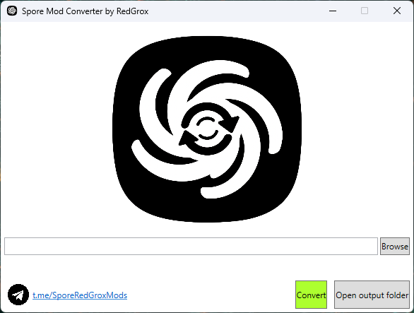

# Spore Mod Converter

Converts Spore package files (DBPF version 3.0) to package files for the February 19, 2008 prototype (DBPF version 2.0)

How to use:
1. Select the package file (Browse button)
2. Click Convert
3. Go to the Converted packages folder (Open output folder button) - your converted file will be there
4. Transfer the converted file to `<prototype path>/Data`
